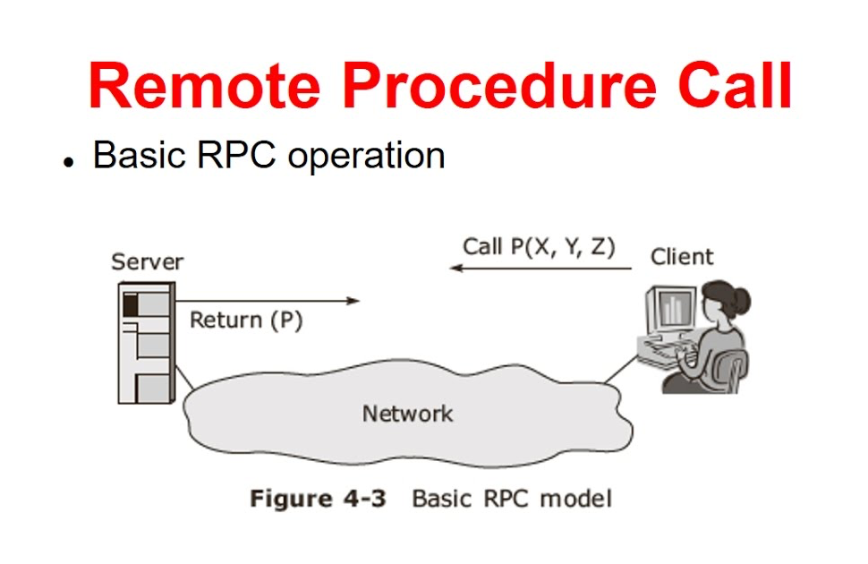
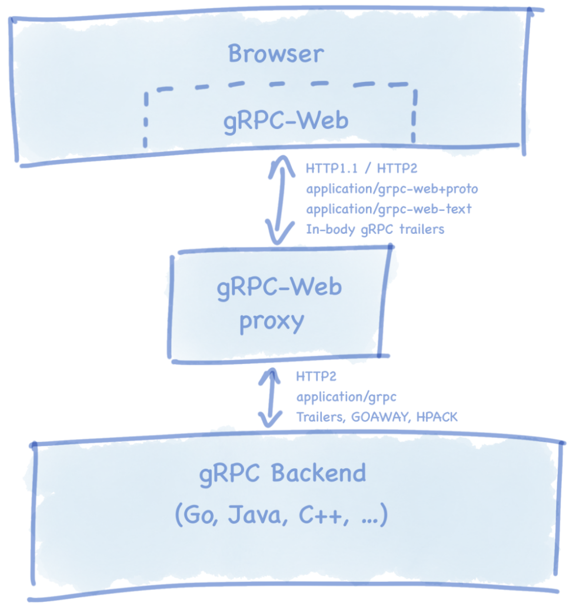

# GRPC Introduction

## Why gRPC?
gRPC is a modern open source high performance Remote Procedure Call (RPC) framework that can run in any environment. It can efficiently connect services in and across data centers with pluggable support for load balancing, tracing, health checking and authentication. It is also applicable in last mile of distributed computing to connect devices, mobile applications and browsers to backend services. [^1]

## What is RPC

**RPC (Remote Procedure Call)** is classic and the oldest API style currently in use. It uses procedure calls to request a service from a remote server the same way you would request a local system — via direct actions to the server (like SendUserMessages, LocateVehicle, addEntry). RPC is an efficient way to build APIs; RPC messages are lightweight and the interactions are straightforward. 

But the more businesses open ways for integration creating the so-called API economy, the harder it is to integrate those systems. Written in different programming languages, tightly coupled with the underlying systems, RPC APIs are difficult to integrate and unsafe to share as they may leak inner implementation details. [^2]



## What is REST API

**REST (Representational State Transfer)** was introduced in 2000, it was meant to solve this problem and make APIs more accessible. Namely, it provided a uniform way to access data indirectly, via resources, using generic HTTP methods such as GET, POST, PUT, DELETE, and so on. REST APIs are basically self-descriptive. This was the main difference between RPC and REST since with RPC, you address the procedures and there’s little predictability of what procedures in different systems may be.

Although REST presented an improved format for interacting with many systems, it returned a lot of metadata, which was the main reason it couldn’t replace simple and lightweight RPC. This was also one of the reasons two new approaches emerged later: **Facebook’s GraphQL** and **gRPC from Google**.

There’s a strong urge to pit all the aforementioned methods against each other and see who wins, but the decision will always come down to what your problem is and which tool is best at solving it. But we will make comparisons to REST as the dominant API design style in our analysis to give a more complex overview of gRPC. [^2]

## gRPC Pros & Cons

### Pros
* Lightweight messages
* High performance
* Built-in code generation
* More connection options
* It is polyglot
* It is strongly typed.

### Cons
* Lack of maturity
* Limited browser support
* Not human-readable format
* Steeper learning curve



## GRPC vs REST

High-level comparison [^3]

| Feature                | gRPC                           | HTTP APIs with JSON           |
|------------------------|--------------------------------|-------------------------------|
| Contract               | Required (.proto)              | Optional (OpenAPI)            |
| Protocol               | HTTP/2                         | HTTP                          |
| Payload                | Protobuf (small, binary)       | JSON (large, human readable)  |
| Specification          | Strict specification           | Loose. Any HTTP is valid.     |
| Streaming              | Client, server, bi-directional | Client, server                |
| Browser support        | No (requires grpc-web)         | Yes                           |
| Security               | Transport (TLS)                | Transport (TLS)               |
| Client code-generation | Yes                            | OpenAPI + third-party tooling |

## Protobuf Sample

```protobuf
syntax = "proto3";

package halome.sample.v1;

import "google/api/annotations.proto";
import "google/api/httpbody.proto";
import "google/protobuf/empty.proto";

message HelloRequest {
  string name = 1;
}

message HelloResponse {
  string message = 1;
  string service = 2;
  int32 port = 3;
}

message UploadRequest {
  google.api.HttpBody raw_body = 2;
}

message EventMessageCreated {
  string messageId = 1;
  string channelId = 2;
  string content = 3;
}

message EventChannelUpdated {
  string channelId = 1;
  string name = 2;
}

service Hello {
  rpc Hello (HelloRequest) returns (HelloResponse) {
    option (google.api.http) = {
      post: "/hello"
    };
  }

  rpc Upload (UploadRequest) returns (google.protobuf.Empty) {
    option (google.api.http) = {
      post: "/upload"
      body: "raw_body"
    };
  }
}
```

## Refs
[^1]: [gRPC io](https://grpc.io)

[^2]: [What is gRPC: Main Concepts, Pros and Cons, Use Cases](https://www.altexsoft.com/blog/what-is-grpc/)

[^3]: [Compare gRPC services with HTTP APIs](https://docs.microsoft.com/en-us/aspnet/core/grpc/comparison?view=aspnetcore-6.0)